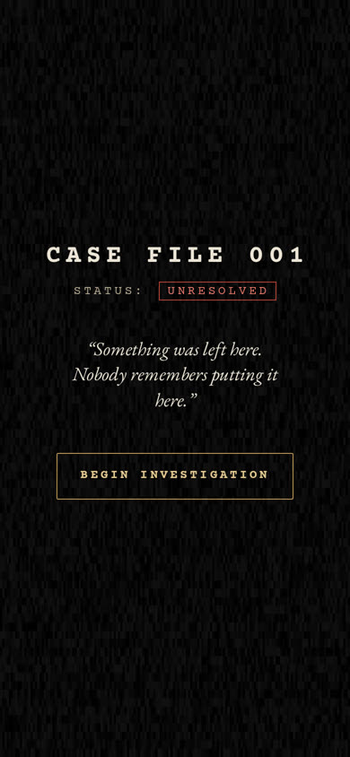
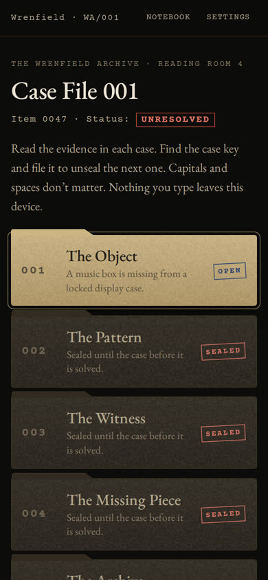
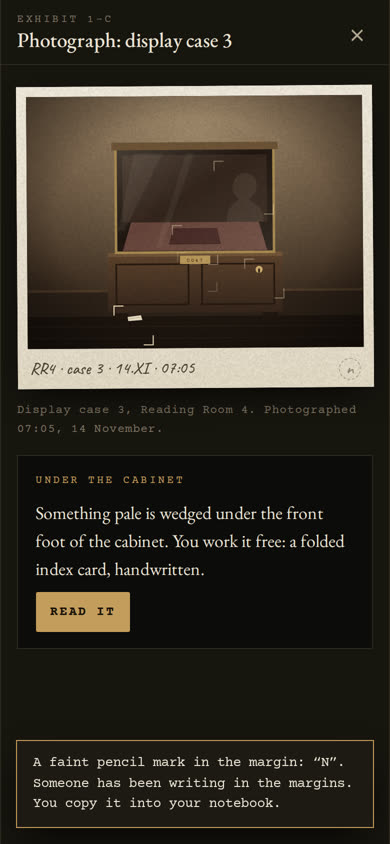
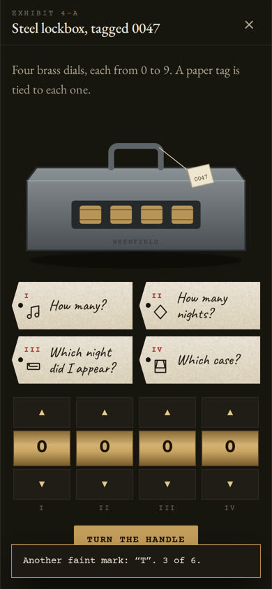

# THE MYSTERY — Case File 001

> **CASE FILE 001 · STATUS: UNRESOLVED**
> *"Something was left here. Nobody remembers putting it here."*

A cinematic, ARG-style digital mystery that runs entirely in the browser. She
opens a link, sees static, and finds an internal file from a small archive that
was never meant to leave Reading Room 4. A walnut music box has vanished from a
locked display case. Six case files, six kinds of evidence, one quiet truth, and
a secret Deep Archive for whoever notices the quietest things.

It is fictional, self-contained, and solvable entirely inside the website. There
is no backend, no tracking, no external services, and nothing personal is ever
asked for.

<p>
  
  
  
  
</p>

> ⚠️ **Spoilers live in this repository.** `docs/SOLUTIONS.md` and `src/content/`
> contain every answer. Keep the repo **private** and never send her the repo
> link. The hosting configs publish only the `site/` folder.

---

## Quick start

| I want to… | Do this |
|---|---|
| **Play it now** | Open `site/index.html` in a browser, or run `npm run serve` → http://localhost:8080 |
| **Put it online (Vercel)** | Import this repo at https://vercel.com/new and press Deploy. No settings needed (`vercel.json`) |
| **Put it online (Netlify)** | Unzip `case-file-001-website.zip`, then drag the folder onto https://app.netlify.com/drop. Details: [docs/DEPLOYMENT.md](docs/DEPLOYMENT.md) |
| **Send one file** | `dist/case-file-001.html`: the whole game in one offline file |
| **Personalise it** | Edit `src/content/config.js`, then `npm run build`. See [docs/CUSTOMIZING.md](docs/CUSTOMIZING.md) |
| **See every answer** | [docs/SOLUTIONS.md](docs/SOLUTIONS.md) (creator's solution guide) |

The built site is committed, so hosting needs no build step. Node.js 18+ is only
needed if you change the content.

## What's inside

**Story structure:** six parts, each with its own case key.

| Part | Title | What happens |
|---|---|---|
| 001 | The Object | A missing music box. Documents, an inspectable photograph, a hidden note. |
| 002 | The Pattern | Six nameless visitor slips and six camera stills with a wall clock. |
| 003 | The Witness | The night custodian's taped testimony contradicts the report, and the tape holds a recording. |
| 004 | The Missing Piece | A lockbox whose four tags each point at earlier evidence, then a cipher wheel. |
| 005 | The Archive | A card index, an ultraviolet lamp, and hidden ink that changes what earlier clues mean. |
| 006 | The Truth | The object was never the point. |
| ◇ | Deep Archive | Unlocked by discovery: bonus evidence, unused documents, a hidden visual, curator's notes, and one final subtle message. |

**Puzzle mechanics:** acrostic and telestich, image clues, analog clock reading,
A1Z26, Morse code (audio, waveform and text), timestamps, curator's symbols, a
multi-clue combination lock, a Caesar cipher wheel, environmental interaction
(inspecting photos, turning cards over, opening drawers, sweeping a UV lamp across
paper), documents, and key discovery. Every solution has a logical path entirely
within the site, and [`tools/verify.mjs`](tools/verify.mjs) proves it (see below).

**Experience:**
- Opening static, scanning light, archival paper, stamps, redactions, manila
  folders, a dark reading room, and restrained typewriter and handwriting type.
  Not a hacker dashboard.
- Subtle sound design, all synthesised live (static, paper, stamps, tape hiss, the
  hum, dial clicks, drawers, the music box). No audio files.
- Every illustration (photograph, CCTV stills, clocks, cassette, lockbox, cipher
  wheel, rooms, music box, the long-exposure plate) is drawn in SVG. No image files.
- Hint system: three escalating hints per case, then an optional reveal, so nobody
  gets permanently stuck.
- A notebook that writes down facts as she finds them, and keeps keys, tools and
  margin marks.
- Near-miss nudges, e.g. typing an anagram of the right answer gets *"Right letters
  in the wrong order."*

## Engineering

| Requirement | How it's met |
|---|---|
| Static website | Plain HTML/CSS/JS in `site/`. No framework, no build needed to host. |
| Mobile-first, low-end Android | Single column, 44px+ touch targets, ~180 KB of fonts, no heavy filters or blur, animations only on transform/opacity, rAF-throttled effects. Tested at 390×844. |
| Local save / reset | `localStorage` (wrapped in try/catch; plays fine without it). Settings → *Reset investigation*. Reloads resume where she left off. |
| Hint system | Per-case tiered hints, state-aware (Case 004's hints change once the box is open), with a confirmed reveal. |
| Accessibility | Semantic headings and landmarks, real buttons for every hotspot, focus-trapped dialogs, Escape and the phone's back button close dialogs, visible focus, `aria-live` announcements, full tape transcript, Morse as waveform and text, UV ink announced to screen readers, large-text option. |
| Reduced motion | Follows the system setting by default, with an in-game override. |
| No backend / database / external sites | Content Security Policy blocks every network request (`connect-src 'none'`). Fonts are bundled (OFL). Works from `file://`. |
| No spoilers in the source | Cases 002–006 and the Deep Archive are sealed with the previous answer (`site/js/seal.js`). Viewing the source reveals nothing. |
| Safety | Nothing personal is collected or requested. Inputs only accept fictional case keys (never `type=password`, autocomplete off). `noindex` and `robots.txt` keep it out of search engines. |

### Project structure

```
site/                 ← the deployable website (upload this folder)
  index.html
  css/style.css
  js/seal.js          content sealing (shared with the build tools)
  js/vault.js         GENERATED: sealed case content
  js/audio.js         synthesised sound
  js/art.js           SVG illustrations
  js/evidence.js      renderers for every exhibit type
  js/app.js           screens, routing, saving, hints, lamp, finale
  assets/             favicon, fonts (+ OFL licences)
src/content/          ← SPOILERS: all story text, evidence, hints, answers
  case1.js … case6.js, deep.js, answers.js, config.js (personalisation)
tools/
  build.mjs           seal content → site/js/vault.js, write dist/case-file-001.html
  verify.mjs          puzzle integrity checks
  serve.mjs           tiny local server
  package.mjs         build + verify + zip
tests/e2e.mjs         full automated playthrough in headless Chromium
docs/                 SOLUTIONS.md (spoilers), CUSTOMIZING.md, DEPLOYMENT.md
dist/                 case-file-001.html (single-file build)
vercel.json           Vercel: publish site/ only, no install, build with fallback
netlify.toml          Netlify: same
index.html, _redirects  if a host serves the whole folder: forward to site/, hide the rest
```

### Commands

```bash
npm run build      # seal src/content into site/js/vault.js, write dist/case-file-001.html
npm run verify     # puzzle integrity + vault checks (no browser needed)
npm run check      # CI: fail if the vault is stale, then verify
npm run serve      # local server on http://localhost:8080
npm run test:e2e   # full playthrough in Chromium (needs Playwright); SHOTS=1 saves screenshots
npm run package    # build + verify + zip: dist/case-file-001.zip (project) and dist/case-file-001-website.zip (game only)
```

### Verification

`npm run verify` (108 checks) derives every answer from the evidence itself:
acrostic and telestich of the note, clock minutes ordered by date → A1Z26, Morse
decoding of the hum (and that it fits the tape timeline), each lock digit read
from the documents, the Caesar shift from the room number, card placement in the
index, the six margin marks spelling the Deep Archive word, and that the finale
contains the required lines in order. It also confirms every sealed blob opens
with exactly its key (plus accepted alternatives), rejects wrong keys, and that no
answer appears anywhere in the page source. Finally, it checks that the Vercel
and Netlify configs publish only the game.

`npm run test:e2e` (65 checks) plays the whole game at phone size, from *Begin
Investigation* through the Deep Archive. It finds all six marks, uses the lamp,
and checks the back button, reload persistence, reset, the hint-reveal path, the
offline single-file build, hosting from the project root, horizontal overflow,
and that the console is free of errors.

GitHub Actions runs the verification on every push (`.github/workflows/verify.yml`).
A manual workflow publishes only `site/` to GitHub Pages
(`.github/workflows/deploy-pages.yml`).

## Browser support

Current Chrome/Edge (including Android Chrome and WebView), Safari/iOS 15+, and
Firefox. It degrades gracefully: without Web Audio it is silent; without
`localStorage` progress isn't saved; without mask support the lamp floods the page.

## Credits

Story, puzzles, art and code are original to this project. Fonts: Courier Prime,
EB Garamond and Caveat, used under the SIL Open Font License (licences in
`site/assets/fonts/`).
